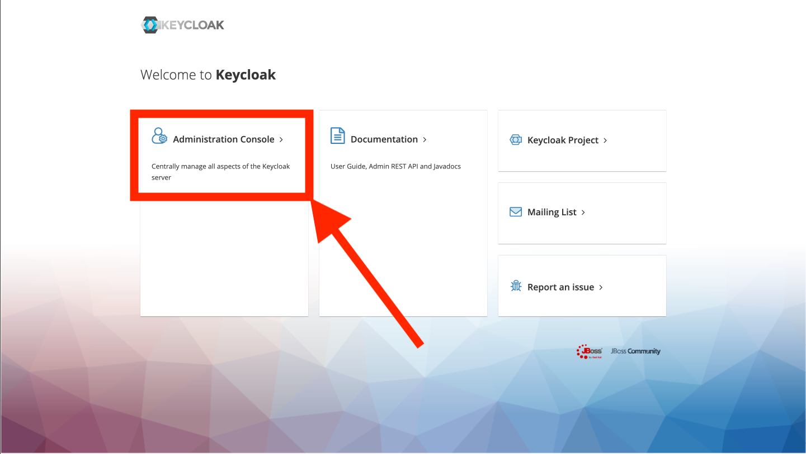
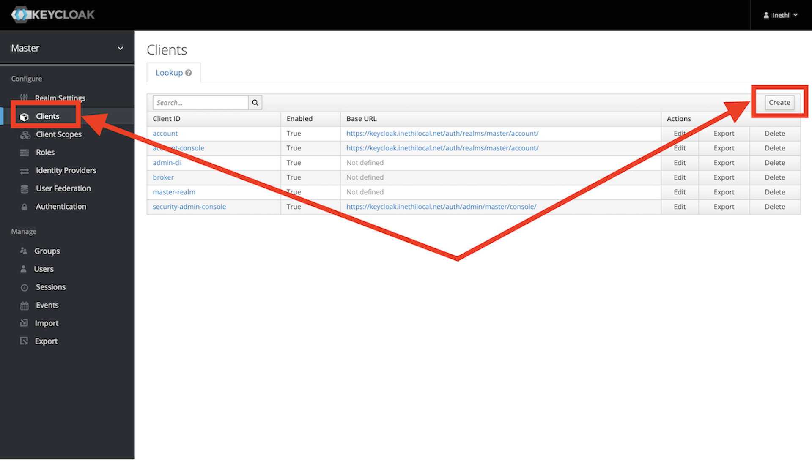
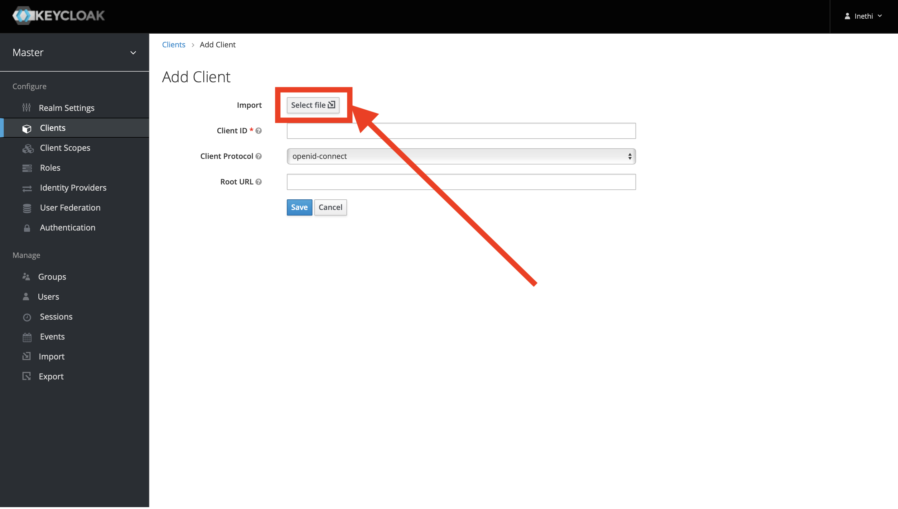
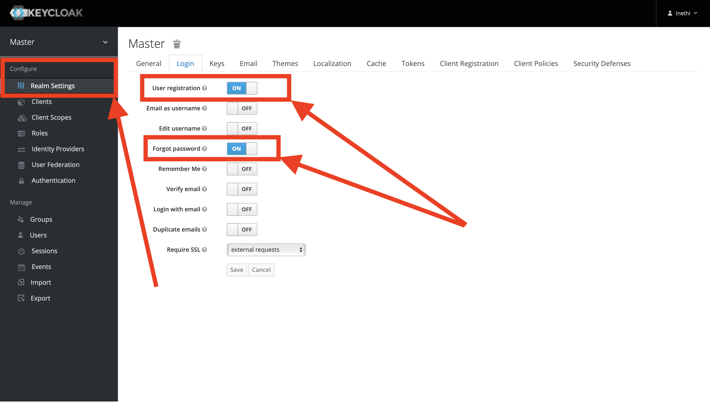

# Configuring Services Post Installation
## Accessing Services
To access services you need to update your firewall settings to direct searches for URLs matching an iNethi service to 
the IP address of your server. Alternatively on a Mac or Ubuntu machine you can edit your hosts file. Lets say you IP 
servers IP address is `10.2.0.10`. Do the following:
1. Open your hosts file with **root** privileges: `sudo nano /etc/hosts`
2. Edit the host file and add the following to the bottom of the file
```
10.2.0.10 traefik.inethilocal.net
10.2.0.10 grafana.inethilocal.net.net
10.2.0.10 prometheus.inethilocal.net
```
You can carry on adding any other services you added to this file. The three services above are installed by default so 
can navigate to these URLs and test if they are working. Sometimes you need to do this in an incognito browser.

The rest of the rules:
```
10.2.0.10 splash.inethilocal.net
10.2.0.10 nextcloud.inethilocal.net
10.2.0.10 keycloak.inethilocal.net
10.2.0.10 jellyfin.inethilocal.net
10.2.0.10 wordpress.inethilocal.net
10.2.0.10 maintain.inethilocal.net
10.2.0.10 radiusdesk.inethilocal.net
```
## Grafana, Prometheus and Traefik
Once you have run the Python build script Traefik, Grafana and Prometheus will automatically be installed and 
configured. Make sure you have added a route to them in your hosts file or firewall.

The following steps are the manual steps you need to take to configure the dashboard and data sources:
1. Navigate to `prometheus.inethilocal.net`. Navigate to the targets page to check if the endpoints are up, do this
using the menu: status -> targets and check that the prometheus and traefik endpoint are up.
2. Navigate to `grafana.inethilocal.net`. Use the default user and password to login which is `admin` and `admin`.
change the password when promted. 
3. Once you are at the homepage, navigate to the data source page and add a new source.
Select prometheus as the source and the only thing to add in the subsequent steps is the prometheus server URL which is
`http://inethi-prometheus:9090`
4. Add a dashboard from the home page/menu navigate to dashboards, add a new dashboard. Use the `import` option and
enter the official Traefik dashboards ID: `17346`, click load next to the text input. On the next page use the 
Prometheus datasource you created in the last step as the data source and then click import. Your dashboard will show 
up.

## Keycloak
### Logging in
Log into keycloak via the admin console at `keycloak.inethilocal.net` using the username `inethi` and password 
`iNethi2023#`.

Set up clients to use the update and management portals:
### Import Real Settings

### Enabling Update and Manage Portals
1. Navigate to the Client settings in your Master realm. Click on `Create` button and import the 
[management portal config file](./keycloak/mange.json).




2. Once this is done follow the same process to upload the 
[update portal config file](./keycloak/update.json).

### Enabling User Registration
1. Navigate to `Realm Settings` and go to the `Login Tab`, enable `User Registration` and `Forgot Password`. Disable all
other fields.

2. Go to the Authentication menu item and go to the Flows tab, you will be able to view the currently defined flows. 
You cannot modify a built-in flows, so, to add the Authenticator you have to copy an existing flow or create your own. Copy the "Browser" flow. 
3. In your copy, click the Actions menu item in Forms subflow and Add Execution. Pick Secret Question and change the Requirement choice. 
4. Go to the Bindings tab in Authentication menu and change the default Browser Flow to your copy of the browser flow and click Save. 
5. Next you have to register the required action that you created. Click on the Required Actions tab in the
Authentication menu. Click on the Register button and choose your new Required Action. You can also choose the Default Action for the Required Action and each new user has to set the secret answer. Your new required action should now be displayed and enabled in the required actions list.